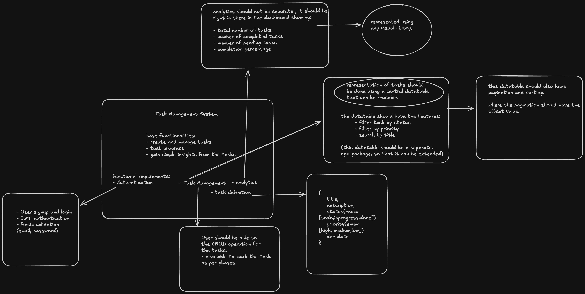

# Task Management System

MERN task tracker. Auth, task CRUD, filtering and search, analytics, and a reusable table component that lives in its own package. Built as an npm workspaces monorepo.



## Live

* Frontend: https://task-management-system-si-client-19.vercel.app

Note: the backend is on Render's free tier, which spins down after 15 minutes of no traffic. If nobody's used it in a while, the first signup or login can take 30-50 seconds while the server wakes back up. Retry if it times out, it'll be fast after that first request.

## Stack

* Frontend: React 19, Vite, TypeScript, Tailwind
* Backend: Node.js, Express 5, TypeScript
* Database: MongoDB, via Mongoose
* Table: `@channi23/datatable`, our own package, built on TanStack Table

## Project layout

```
apps/
  client/     React frontend
  server/     Express API
packages/
  datatable/  reusable, source-agnostic table component
```

## Setup

You need Node installed and a MongoDB connection string (Atlas is fine, free tier works well enough).

1. Install from the root, this installs all three workspaces at once:

```
npm install
```

2. Build the datatable package. The client imports it from `dist/`, and that folder isn't committed to git, so this has to run once before the client will actually resolve the import:

```
cd packages/datatable
npm run build
```

3. Set up the server:

```
cd apps/server
cp .env.example .env
```

Open `.env` and fill in `MONGO_URI` and `JWT_SECRET`. Then:

```
npm run dev
```

4. In a second terminal, start the client:

```
cd apps/client
npm run dev
```

The client's `.env` is optional for local dev. If you don't set `VITE_API_URL`, it just falls back to `http://localhost:5001/api`.

Server runs on port 5001, client on 5173.

## API

Everything under `/api/tasks` needs `Authorization: Bearer <token>`.

* `POST /api/auth/signup` - create an account, returns a token
* `POST /api/auth/login` - log in, returns a token
* `GET /api/tasks` - list your tasks, supports offset/limit paging, sortBy/sortDir, status and priority filters, and search
* `POST /api/tasks` - create a task
* `GET /api/tasks/:id` - get one task
* `PUT /api/tasks/:id` - update a task, partial updates only, only send the fields that changed
* `DELETE /api/tasks/:id` - delete a task
* `PATCH /api/tasks/:id/complete` - shortcut to mark a task as done
* `GET /api/tasks/analytics` - totals, completion percentage, status and priority breakdown, on time vs late
* `GET /api/tasks/all-users` - admin only, task count per each user

## Design decisions

Few things worth explaining:

**The datatable package is source-agnostic, and that's the whole point of building it separately.** It never fetches data itself. It takes a `DataSource` object with one method, `fetch(params)`, that returns `{ rows, totalRows }`, and the table only ever talks to that interface. It has no idea whether the data behind it is a plain array in memory or a live API call. Right now there are two implementations: `LocalDataSource` for static data, used while the table was being built before the backend even existed, and `ApiDataSource` for the real endpoint this app actually runs on. From the table's point of view they're interchangeable, swapping one for the other in `Tasks.tsx` was literally a one line change.

Out of the box it already handles the things a real task list needs: server driven pagination, per column sorting, text search, and per column filtering, all expressed as plain query parameters (`offset`, `limit`, `sortBy`, `sortDir`, `search`, and arbitrary filter fields) that any backend can implement however it wants. Columns opt in to sorting and filtering individually through their definition, so a consumer isn't forced to make every column interactive.

The actual payoff is reuse. Because the table doesn't know anything about tasks specifically, it can drop into a completely different project, a contacts list, an orders table, an admin user list, without touching a single line inside the package. Whoever uses it just writes one small class satisfying the `DataSource` interface for wherever their data lives, whether that's a REST endpoint, GraphQL, a websocket feed, or a browser side cache, and the table's rendering, sorting, filtering and pagination logic stay exactly as it is. That's also why it was built and versioned as its own npm package inside the workspace rather than as a component sitting in `apps/client`, it's meant to outlive this specific project.

**Tasks reference users, they don't copy user data into themselves.** `Task.user` is a Mongo ObjectId pointing back at a `User` document. We didn't embed the email or role inside each task. User info can change and a task shouldn't be carrying around a stale copy of it. Every task query already filters by that `user` id anyway, which is also why there is a compound index on `(user, status, priority)`.

**completedAt is set server side, the client can't touch it.** When a task status flips to done, the server stamps the current time itself. It's not even read out of the request body if a client tries to send it. This matters because the analytics endpoint compares `completedAt` against `dueDate` to figure out if a task was late, and that number is only trustworthy if nobody can fake the timestamp from the frontend.

**PUT only updates fields that were actually sent.** Early on the update handler just took the whole request body and used it as the Mongo update. Problem is, leaving a field out of a partial edit isn't the same as not touching it, Mongoose will happily set it to null. Now the route checks each field one by one before adding it to the update object, so sending just `{ status: "done" }` doesn't wipe out the title or priority.

## Auth

JWT in the `Authorization` header, 7 day expiry, no refresh tokens, no server side sessions. Passwords are hashed with bcrypt before anything touches the database, plaintext password never gets stored anywhere.

## Credits

Built by Hariharan.

Tools and references used along the way, the React docs for component and hooks behaviour, the Magic UI docs for the animated components on frontend, and Claude as a mentor for talking through design decisions and getting a second opinion on trade offs.
